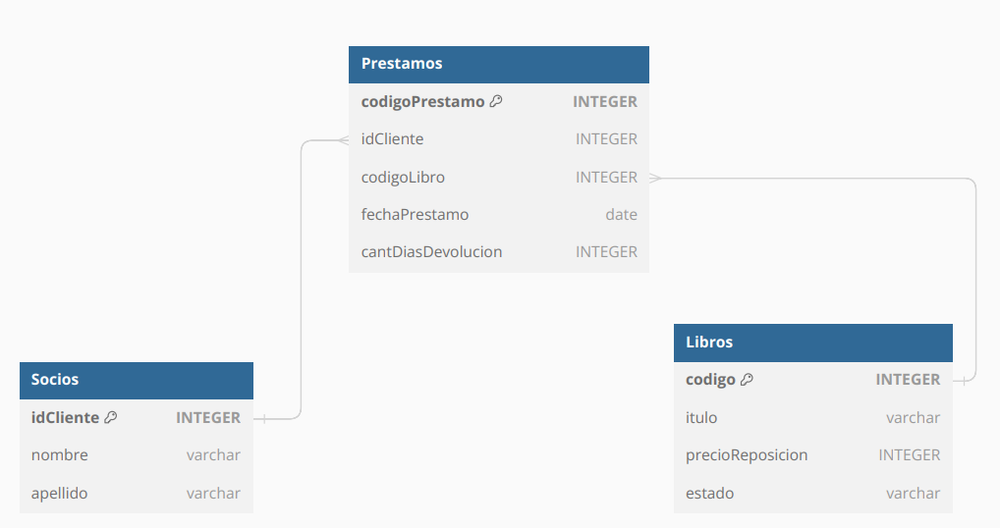

# Sistema de Préstamo de Libros

## Tabla de Contenido
1. [Información General](#InformacionGeneral)
2. [Objetivo](#Objetivo)
3. [Tecnologías](#Tecnologias)
4. [Alcances](#Alcances)
5. [Imágenes Referenciales](#ImagenesReferenciales)

### Información General
Proyecto práctico aplicado integrador grupal en Python con interfaz gráfica usando Tkinter. Desarrollo de un software para la gestión de préstamos y devoluciones de libros en una biblioteca.

### Objetivo
Desarrollar un sistema que permita a la biblioteca registrar libros, socios, préstamos y devoluciones. Además, deberá generar reportes sobre el estado de los libros, préstamos demorados, entre otras funcionalidades.

## Tecnologías
* Lenguaje de Programación: Python
* Interfaz Gráfica: Tkinter
* Base de Datos: SQLite
  
### Alcances
* Administración de socios
* Administración de libros
* Registración de préstamos y devoluciones
* Registración de libros extraviados

### Imagenes Referenciales

#### Diagrama Base de datos
